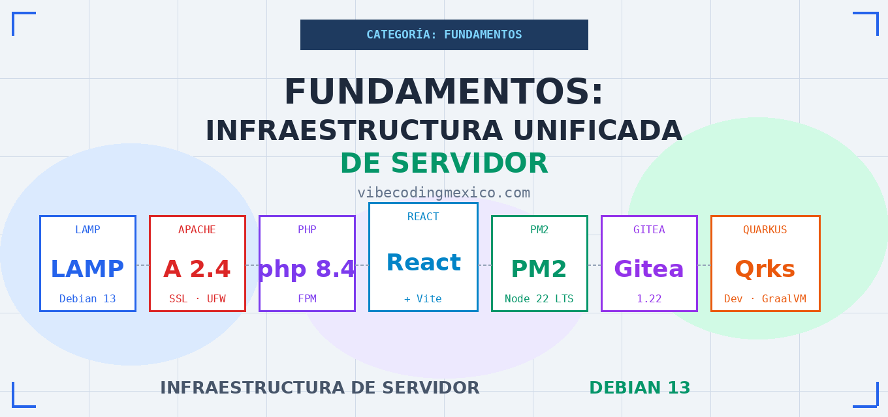

[](https://www.php.net/)
[](https://opensource.org/licenses/MIT)
# 🛠️ Manual: LAMP + Node + React + PM2 + Gitea + Quarkus Dev en Debian 13

[](https://www.php.net/)
[](https://opensource.org/licenses/MIT)

**Stack:** LAMP (Debian 13) + SSL Certbot + PHP 8.4 + Node 22 + React/Vite + PM2 + Gitea + Quarkus Dev  
**Plataforma base:** Vultr VPS (o similar con root real)  
**Fecha de redacción:** Enero 2026

---

## ⚠️ Advertencia Importante Antes de Empezar: React y Seguridad

> **El autor de este manual redactó estas instrucciones en enero de 2026 y recomienda ir pensando en migrar de React a otras plataformas.**

En diciembre de 2025 se divulgó públicamente **CVE-2025-55182** ("React2Shell"), una vulnerabilidad de ejecución remota de código (RCE) con puntuación CVSS 10.0 — la máxima posible — en los React Server Components. En los días siguientes surgieron tres vulnerabilidades adicionales en el mismo ecosistema:

- **CVE-2025-55183** (CVSS 5.3 — Media): Exposición de código fuente del servidor. Un atacante puede forzar a que una Server Function devuelva su propio código fuente como cadena, potencialmente exponiendo lógica de negocio, cadenas de conexión a bases de datos y claves de API hardcodeadas.
- **CVE-2025-55184** (CVSS 7.5 — Alta): Denegación de servicio. Una petición HTTP maliciosa provoca un bucle infinito que cuelga el proceso del servidor y consume CPU al máximo.
- **CVE-2025-67779** (CVSS 7.5 — Alta): Parche incompleto del CVE anterior; las versiones "parcheadas" 19.0.2, 19.1.3 y 19.2.2 seguían siendo vulnerables.

Grupos de amenaza persistente avanzada (APT) alineados con China comenzaron a explotar React2Shell dentro de horas de su divulgación pública, según reportes de Google Threat Intelligence y Cloudflare. Los ataques incluyeron despliegue de backdoors (HISONIC, COMPOOD), mineros de criptomonedas y túneles de red.

**Este manual cubre React en su modo más simple** (archivos estáticos servidos por Apache, sin React Server Components). En ese modo, los CVE anteriores **no aplican directamente**. Sin embargo, la cadena de eventos evidencia un problema estructural más profundo:

> El ecosistema npm de React acumula cientos de dependencias transitivas que hacen que la superficie de ataque sea muy difícil de auditar. Por esta razón, React **no es la opción recomendada por defecto** en entornos regulados como facturación electrónica, salud, sistemas financieros o cualquier contexto donde se requiera auditoría formal de dependencias. Para esos casos, considere alternativas con menor superficie de dependencias o frameworks backend que no requieran un bundler de frontend complejo.

**Alternativas a evaluar:** Vue.js, Next.js (con Server Components desactivados), Astro, o directamente PHP con bibliotecas específicas.

Este es un manual operativo y reproducible. React se incluye porque es el estándar de facto en 2026 y porque hay demanda real de personal especializado. No es la recomendación del autor para proyectos nuevos en contextos críticos.

---

## 📋 Premisas

1. **Estás en Vultr** con Debian 13 limpio. Si usas otro proveedor, necesitas cliente SSH (como PuTTY).
2. **Tienes acceso como `root`**. Algunos proveedores como OVHcloud usan un usuario intermedio (`debian`) que rompe el flujo estándar de PM2 y Node — ver sección OVHcloud más adelante.
3. **Ya tienes un dominio** apuntando a la IP del VPS.
4. **El dominio importa — sustitúyelo completo.** Reemplaza `tu-dominio.com` en **todos** los scripts.

> Abre un bloc de notas y anota: IP del servidor, password root, contraseña MariaDB, usuario/password Gitea. Los necesitarás varias veces.

---

## ⚠️ Nota sobre OVHcloud

OVHcloud obliga a usar un usuario intermedio llamado `debian` en lugar de root directo. Esto causa problemas graves e inconsistentes con PM2, NVM y la gestión de permisos de npm. En enero de 2026 se verificaron instancias del mismo proveedor donde una funcionaba con PM2 y otra recién levantada no.

**Recomendación:** Usa OVHcloud solo para LAMP básico (WordPress, Laravel, PHP puro). Para Node.js, React con SSR, PM2 o Spring Boot, usa Vultr u otro proveedor que dé root real sin capas de abstracción intermedias.

Si tu plataforma no es reproducible entre servidores del mismo proveedor, el problema es la plataforma, no tu configuración.

---

## 1. Actualización del Sistema

```bash
apt update && apt upgrade -y
```

---

## 2. Instalación del Stack LAMP

```bash
apt install apache2 php8.4 php8.4-mysql mariadb-server -y
```

### Extensiones PHP

```bash
# Extensiones esenciales en un solo comando
apt install -y php8.4-fpm php8.4-mysql php8.4-curl php8.4-bcmath php8.4-xml \
  php8.4-mbstring php8.4-zip php8.4-gd php8.4-intl

# Por qué cada una importa:
# php-curl    — peticiones externas, APIs de pago, verificación de licencias
# php-bcmath  — aritmética de precisión, indispensable en facturación electrónica
# php-xml     — estructuras XML, CFDI, RSS
# php-mbstring — cadenas multibyte, caracteres especiales en español
```

### Habilitar módulos Apache

```bash
a2enmod rewrite
a2enmod ssl
a2enmod proxy
a2enmod proxy_http
systemctl restart apache2
```

### Activar PHP-FPM

```bash
systemctl restart php8.4-fpm
systemctl enable php8.4-fpm
```

> En OVHcloud, `php -v` puede mostrar una versión diferente. Verifica antes de continuar.

---

## 3. Firewall (UFW)

Ejecuta cada regla por separado para detectar errores fácilmente:

```bash
apt install ufw -y

ufw default deny incoming
ufw default allow outgoing

ufw allow ssh
ufw allow http
ufw allow https

ufw allow 22/tcp
ufw allow 80/tcp
ufw allow 443/tcp

ufw enable
```

---

## 4. Base de Datos (MariaDB)

### Seguridad inicial

Si `mysql_secure_installation` da error en Debian puro (modo no-Ubuntu), ve al **Anexo 1**.

```bash
mysql_secure_installation
```

### Crear bases de datos y usuario de aplicación

> **Buena práctica:** Nunca uses `root` desde tu aplicación. Crea un usuario dedicado.

```bash
mysql -u root -p
```

```sql
-- Crear usuario de aplicación
CREATE USER 'adminsql'@'localhost' IDENTIFIED BY 'TuClaveSeguraAqui';

-- Crear bases de datos
CREATE DATABASE db_principal;
CREATE DATABASE db_gitea;
CREATE DATABASE db_spring_test;
CREATE DATABASE db_extra1;
CREATE DATABASE db_extra2;
CREATE DATABASE db_extra3;

-- Dar permisos
GRANT ALL PRIVILEGES ON *.* TO 'adminsql'@'localhost' WITH GRANT OPTION;

FLUSH PRIVILEGES;
SHOW DATABASES;
EXIT;
```

### Ajuste de memoria para servidores de 4GB (con Java conviviendo)

Si vas a correr Quarkus o Spring en el mismo servidor, reduce el buffer de InnoDB para dejarle aire a la JVM:

```bash
nano /etc/mysql/mariadb.conf.d/99-ajustes-memoria.cnf
```

```ini
[mysqld]
innodb_buffer_pool_size = 512M
max_connections = 200
sql_mode = ""
```

> Si el cambio no aplica, hay otro archivo que lo sobreescribe. Ve al **Anexo 2**.

```bash
systemctl restart mariadb
```

Verificar que aplicó (debe dar 536870912):

```bash
mysql -u root -p -e "SHOW VARIABLES LIKE 'innodb_buffer_pool_size';"
```

---

## 5. VirtualHost Apache

### Crear directorios

```bash
mkdir -p /var/www/tu-dominio.com/public_html/app
chown -R www-data:www-data /var/www/tu-dominio.com
chmod -R 755 /var/www/tu-dominio.com
```

> **Recomendación:** Pon un `<h1>Hola!</h1>` en `public_html/index.html` y otro en `public_html/app/index.html` **antes** de continuar. Verifica que ves lo correcto ahora y no en dos horas cuando hayas avanzado más.

### Archivo de configuración

```bash
nano /etc/apache2/sites-available/tu-dominio.com.conf
```

```apache
<VirtualHost *:80>
    ServerName tu-dominio.com
    ServerAlias www.tu-dominio.com
    ServerAdmin tucuenta@gmail.com

    DocumentRoot /var/www/tu-dominio.com/public_html

    <Directory /var/www/tu-dominio.com/public_html>
        Options -Indexes +FollowSymLinks
        AllowOverride All
        Require all granted
    </Directory>

    # Bloque específico para la app React en subdirectorio /app
    <Directory /var/www/tu-dominio.com/public_html/app>
        RewriteEngine On
        RewriteBase /app/
        RewriteRule ^index\.html$ - [L]
        RewriteCond %{REQUEST_FILENAME} !-f
        RewriteCond %{REQUEST_FILENAME} !-d
        RewriteRule . /app/index.html [L]
    </Directory>

    ErrorLog ${APACHE_LOG_DIR}/tu-dominio-error.log
    CustomLog ${APACHE_LOG_DIR}/tu-dominio-access.log combined
</VirtualHost>
```

```bash
a2ensite tu-dominio.com.conf
systemctl reload apache2
apache2ctl configtest
```

---

## 6. Certificados SSL con Certbot

> El dominio debe apuntar a la IP del VPS **antes** de ejecutar esto.

```bash
apt install certbot python3-certbot-apache -y
certbot --apache -d tu-dominio.com -d www.tu-dominio.com

# Verificar renovación automática
systemctl status certbot.timer
systemctl list-timers | grep certbot
certbot renew --dry-run
```

---

## 7. Node.js 22 LTS y PM2

### Instalar Node.js desde NodeSource (no los repos estándar de Debian, que traen versión antigua)

```bash
curl -fsSL https://deb.nodesource.com/setup_22.x | bash -
apt install -y nodejs

# Verificar
node -v   # debe mostrar v22.x
npm -v    # debe mostrar 10.x
```

### Instalar PM2

PM2 es el gestor de procesos que hace "inmortal" cualquier app de Node: la reinicia automáticamente si falla, persiste entre reinicios del servidor y da monitoreo en tiempo real.

```bash
npm install pm2 -g
```

### Configurar PM2 para arranque automático

```bash
pm2 startup
```

> Normalmente este comando te da una línea larga que empieza con `sudo env PATH=...` que debes copiar y pegar. En Debian limpio, a veces detecta el sistema y lo configura solo. Si quieres forzarlo:

```bash
pm2 startup systemd
pm2 save
```

Verificar que el servicio está activo:

```bash
systemctl status pm2-root
```

Si dice `active (running)`, ya tienes infraestructura autocurativa para Node.

> **Tip de monitoreo:** Ejecuta `pm2 monit` para ver un panel en tiempo real de RAM y CPU de cada proceso. Vital cuando tienes MariaDB, Gitea y Quarkus conviviendo.

### Solucionar problemas de ruta (si PM2 dice "comando no encontrado")

```bash
# Crear enlace simbólico al binario
ln -s /usr/local/bin/pm2 /usr/bin/pm2

# Limpiar caché de rutas del shell
hash -r
```

> El servicio se llama `pm2-root` porque se instaló como usuario root. Si lo instala un usuario normal, se llamará `pm2-nombreusuario`.

---

## 8. React con Vite

### ¿Por qué Vite y no Create React App?

Create React App está deprecado. Vite es el estándar actual: más rápido, más ligero y con mejor soporte de la comunidad.

### Advertencia de seguridad previa (lee esto antes de instalar)

Este manual cubre React en modo estático — archivos compilados servidos directamente por Apache, **sin React Server Components (RSC)**. En este modo los CVE de diciembre 2025 (CVE-2025-55182, CVE-2025-55183, CVE-2025-55184) **no aplican**, ya que esas vulnerabilidades requieren un servidor Node activo procesando peticiones RSC.

Si en algún momento migras a Next.js, React Router con SSR, Waku o cualquier framework que use RSC, revisa el estado de seguridad de tu versión antes de desplegar en producción.

### Crear el proyecto

React no se "instala" en el sistema. Se compila. El código fuente vive en el servidor, pero lo que sirve Apache son archivos estáticos compilados.

```bash
mkdir -p /home/git/proyectos
cd /home/git/proyectos

npm create vite@latest mi-app-react -- -y --template react
cd mi-app-react
npm install
```

### Configurar Vite para subdirectorio `/app`

```bash
nano vite.config.js
```

```javascript
import { defineConfig } from 'vite'
import react from '@vitejs/plugin-react'

export default defineConfig({
  plugins: [react()],
  base: '/app/',  // La clave para convivir con WordPress u otro sitio en la raíz
})
```

> **Nota sobre `@vitejs/react-swc`:** Si al instalar obtienes un error de token expirado o de paquete no encontrado, limpia el cache y usa el plugin estándar:

```bash
rm -f ~/.npmrc
npm cache clean --force
npm install @vitejs/plugin-react --save-dev
```

El `vite.config.js` con `import react from '@vitejs/plugin-react'` (sin `-swc`) funciona igual de bien.

### Compilar

```bash
npm run build
```

### Desplegar en Apache

```bash
mkdir -p /var/www/tu-dominio.com/public_html/app
cp -r dist/* /var/www/tu-dominio.com/public_html/app/
chown -R www-data:www-data /var/www/tu-dominio.com/public_html/app/
chmod -R 755 /var/www/tu-dominio.com/public_html/app/

# Permisos de directorio para que Apache pueda leer
chmod o+x /var/www
chmod o+x /var/www/tu-dominio.com
chmod o+x /var/www/tu-dominio.com/public_html
chmod o+x /var/www/tu-dominio.com/public_html/app
```

### Ciclo de actualización (cada vez que haces cambios)

```bash
# 1. Compilar en el directorio del proyecto
cd /home/git/proyectos/mi-app-react
npm run build

# 2. Limpiar el destino y copiar
rm -rf /var/www/tu-dominio.com/public_html/app/*
cp -r dist/* /var/www/tu-dominio.com/public_html/app/

# 3. Restaurar permisos
chown -R www-data:www-data /var/www/tu-dominio.com/public_html/app/
chmod -R 755 /var/www/tu-dominio.com/public_html/app/
```

---

## 9. Gitea (Control de Versiones Propio)

### Gitea vs Gitea Actions — diferencia importante

**Gitea** es el servidor de repositorios Git: interfaz web, gestión de usuarios, organizaciones, pull requests, issues, wikis. Es el equivalente a tener tu propio GitHub privado en tu servidor. Es un binario de Go, sin dependencias externas.

**Gitea Actions** es el sistema de CI/CD integrado en Gitea, equivalente a GitHub Actions. Permite ejecutar flujos automatizados (pruebas, builds, deploys) al hacer push a un repositorio. **Gitea Actions requiere un runner separado** — un proceso adicional que escucha y ejecuta los trabajos. No se instala con el binario de Gitea; hay que instalar y configurar `act_runner` por separado.

Este manual instala **solo Gitea base** (repositorios y control de versiones). Gitea Actions queda como expansión futura cuando el servidor y los flujos de trabajo lo justifiquen.

### Crear usuario del sistema para Gitea

```bash
adduser \
  --system \
  --shell /bin/bash \
  --gecos 'Gitea' \
  --group \
  --disabled-password \
  --home /home/gitea \
  gitea
```

### Crear directorios

```bash
mkdir -p /var/lib/gitea/{custom,data,log}
chown -R gitea:gitea /var/lib/gitea/
chmod -R 750 /var/lib/gitea/

mkdir -p /etc/gitea
chown root:gitea /etc/gitea
chmod 770 /etc/gitea
```

### Descargar el binario

Verifica la versión más reciente en https://dl.gitea.com/gitea/

```bash
wget -O /usr/local/bin/gitea \
  https://dl.gitea.com/gitea/1.22.3/gitea-1.22.3-linux-amd64

chmod +x /usr/local/bin/gitea
gitea --version
```

### Crear servicio systemd

```bash
nano /etc/systemd/system/gitea.service
```

```ini
[Unit]
Description=Gitea (Git with a cup of tea)
After=syslog.target
After=network.target

[Service]
RestartSec=2s
Type=simple
User=gitea
Group=gitea
WorkingDirectory=/var/lib/gitea/
ExecStart=/usr/local/bin/gitea web --config /etc/gitea/app.ini
Restart=always
Environment=USER=gitea HOME=/home/gitea GITEA_WORK_DIR=/var/lib/gitea

[Install]
WantedBy=multi-user.target
```

```bash
systemctl daemon-reload
systemctl enable gitea
systemctl start gitea
systemctl status gitea
```

### Configurar Apache como proxy inverso para Gitea

Gitea corre en el puerto 3000 internamente. **No abras el puerto 3000 en UFW** — el tráfico debe pasar por Apache.

```bash
nano /etc/apache2/sites-available/git.tu-dominio.com.conf
```

```apache
<VirtualHost *:80>
    ServerName git.tu-dominio.com
    ServerAdmin admin@tu-dominio.com

    ProxyPreserveHost On
    ProxyRequests Off
    ProxyPass / http://localhost:3000/
    ProxyPassReverse / http://localhost:3000/

    ErrorLog ${APACHE_LOG_DIR}/gitea-error.log
    CustomLog ${APACHE_LOG_DIR}/gitea-access.log combined
</VirtualHost>
```

```bash
a2ensite git.tu-dominio.com.conf
apache2ctl configtest
systemctl reload apache2
```

### SSL para el subdominio de Gitea

Primero crea el registro DNS tipo A: `git` → IP de tu VPS. Espera a que propague, luego:

```bash
certbot --apache -d git.tu-dominio.com
```

### Instalación web de Gitea

Abre `https://git.tu-dominio.com` en el navegador. En el asistente:

- **Base de datos:** SQLite3 (suficiente para uso personal o equipo pequeño)
- **URL base:** `https://git.tu-dominio.com/`
- **Cuenta administrador:** anótala ahora — Gitea no tiene recuperación de contraseña por correo por defecto

### Desactivar registro público (obligatorio si es uso privado)

```bash
nano /etc/gitea/app.ini
```

Busca o crea la sección `[service]`:

```ini
[service]
DISABLE_REGISTRATION = true
SHOW_REGISTRATION_BUTTON = false
ALLOW_ONLY_EXTERNAL_REGISTRATION = false
```

```bash
systemctl restart gitea
```

Verifica en ventana de incógnito que `https://git.tu-dominio.com/user/sign_up` no permite registro.

### Permisos finales

```bash
sudo chmod 750 /etc/gitea
sudo chmod 640 /etc/gitea/app.ini
```

---

## 10. Quarkus Dev

### Quarkus vs GraalVM Native — diferencia importante

**Quarkus en modo JVM (o Dev):** Corre sobre la JVM estándar. Arranque en segundos. Ideal para desarrollo, pruebas y servidores donde la memoria y el tiempo de arranque no son críticos. Es lo que instalamos aquí.

**Quarkus con GraalVM Native Image:** Compila la aplicación a un ejecutable nativo (sin JVM en tiempo de ejecución). El resultado arranca en milisegundos y consume mucho menos RAM — en benchmarks, una app que usa 200MB en JVM puede usar 30MB en nativo. El costo: el proceso de compilación nativa tarda varios minutos y requiere GraalVM instalado, que a su vez necesita más RAM durante la compilación (mínimo 4GB recomendados).

Para un servidor de 4GB con MariaDB, Apache y Gitea conviviendo, el modo Dev/JVM es el punto de partida correcto. La compilación nativa queda como optimización futura cuando el proyecto justifique el setup.

### Instalar Maven y Gradle

```bash
apt update
apt install maven -y
mvn -version  # debe mostrar JDK 21

apt install gradle -y
gradle -v
```

Maven es el estándar para la mayoría de proyectos Spring/Quarkus. Gradle es más rápido y consume menos RAM; sufre menos corrupción de caché. Tener los dos disponibles permite detectar y aislar problemas de permisos más fácilmente.

### Crear el proyecto Quarkus

```bash
mkdir -p /var/www/quarkus-app
chown -R $USER:$USER /var/www/quarkus-app
cd /var/www/quarkus-app

mvn io.quarkus.platform:quarkus-maven-plugin:3.6.4:create \
  -DprojectGroupId=com.aoa \
  -DprojectArtifactId=monitoreo-quarkus \
  -DclassName="com.aoa.GreetingResource" \
  -Dpath="/quarkus"

cd monitoreo-quarkus
```

La primera vez Maven descarga muchas dependencias. Espera el letrero verde de `BUILD SUCCESS` antes de continuar.

### Configurar puerto y host

```bash
mkdir -p src/main/resources
nano src/main/resources/application.properties
```

```properties
quarkus.http.port=8081
quarkus.http.host=127.0.0.1
```

Usamos el puerto 8081 para no colisionar con Spring (8080) si estuviera instalado, y `127.0.0.1` para que solo Apache pueda acceder internamente.

### Ajustar pom.xml para JDK 21

Si Maven muestra error de versión no soportada:

```bash
nano pom.xml
```

Busca `<properties>` y asegúrate de tener:

```xml
<maven.compiler.release>21</maven.compiler.release>
<maven.compiler.source>21</maven.compiler.source>
<maven.compiler.target>21</maven.compiler.target>
```

### Dar permisos al wrapper y arrancar

```bash
cd /var/www/quarkus-app/monitoreo-quarkus
chmod +x mvnw
./mvnw quarkus:dev -Dquarkus.http.port=8081
```

Cuando veas `Listening on: http://127.0.0.1:8081`, Quarkus está listo.

### Configurar Apache para exponer Quarkus vía proxy

Edita el VirtualHost SSL (el que Certbot generó):

```bash
nano /etc/apache2/sites-available/tu-dominio.com-le-ssl.conf
```

Agrega dentro del bloque `<VirtualHost>`:

```apache
# Proxy para Quarkus Dev
ProxyPass /quarkus http://127.0.0.1:8081
ProxyPassReverse /quarkus http://127.0.0.1:8081
```

```bash
apache2ctl configtest
systemctl restart apache2
```

### Verificación final

Abre en el navegador: `https://tu-dominio.com/quarkus`

Debe responder con el "Hello from Quarkus REST" de la clase `GreetingResource`. Si ves eso, lograste:

- Pasar por el proxy de Apache correctamente
- SSL funcionando sin errores de certificado
- Aislamiento de puertos: Quarkus en 8081, internamente, sin exposición directa

---

## ✅ Checklist Final

```bash
# Node.js
node -v                          # v22.x

# PM2
systemctl status pm2-root        # active (running)

# React compilado
ls /var/www/tu-dominio.com/public_html/app/   # index.html y assets/

# React accesible (HTTP antes de certbot, HTTPS después)
curl -I https://tu-dominio.com/app/           # 200 OK

# Gitea corriendo
systemctl status gitea                        # active (running)
curl -I http://127.0.0.1:3000                 # 200 OK

# Registro de Gitea deshabilitado
grep DISABLE_REGISTRATION /etc/gitea/app.ini  # true

# Quarkus corriendo
curl -I http://127.0.0.1:8081/quarkus         # 200 OK
```

---

## 📝 Notas Finales

- Sustituye `tu-dominio.com` y `git.tu-dominio.com` en **todos** los pasos.
- Nunca expongas credenciales de base de datos en repositorios públicos. Usa `.env` excluido del control de versiones.
- El puerto 3000 (Gitea) y el 8081 (Quarkus) nunca deben abrirse en UFW — solo Apache los consume internamente.
- Documenta qué versión de cada tecnología instalaste y en qué fecha. Los sistemas se degradan con el tiempo y esa información es oro cuando hay que diagnosticar.
- **Sobre npm y auditorías:** `npm audit` es el primer paso, pero en proyectos React con dependencias transitivas es común ver cientos de paquetes. En entornos que requieren auditoría formal (IMSS, SAT, hospitales, sistemas financieros), este volumen hace que la auditoría sea prácticamente inviable sin herramientas especializadas. Considéralo antes de elegir React para esos contextos.

---

## Anexo 1: MariaDB modo seguro manual en Debian 13

Si `mysql_secure_installation` falla, entra a MariaDB directamente:

```bash
mariadb
```

```sql
-- Cambiar contraseña de root
SET PASSWORD FOR 'root'@'localhost' = PASSWORD('TuClaveSegura');

-- Eliminar usuarios anónimos
DELETE FROM mysql.user WHERE User='';

-- Bloquear acceso remoto de root
DELETE FROM mysql.user WHERE User='root' AND Host NOT IN ('localhost', '127.0.0.1', '::1');

-- Borrar base de datos de prueba
DROP DATABASE IF EXISTS test;
DELETE FROM mysql.db WHERE Db='test' OR Db='test\\_%';

FLUSH PRIVILEGES;
EXIT;
```

---

## Anexo 2: Forzar configuración de MariaDB cuando hay múltiples archivos

En Debian, MariaDB carga archivos de configuración en orden alfabético/numérico. Si tu cambio no aplica, es porque otro archivo lo sobreescribe. La solución es crear un archivo con número alto que se cargue al final:

```bash
nano /etc/mysql/mariadb.conf.d/99-ajustes-memoria.cnf
```

```ini
[mysqld]
innodb_buffer_pool_size = 512M
```

```bash
systemctl restart mariadb
mysql -u root -p -e "SHOW VARIABLES LIKE 'innodb_buffer_pool_size';"
# Debe mostrar: 536870912
```

---

## Anexo 3: Limpieza total — regresar a LAMP puro

Útil si OVHcloud u otro proveedor bloqueó PM2/Node o si quieres resetear el servidor:

```bash
# 1. Detener y desinstalar PM2
pm2 kill || true
npm uninstall -g pm2
rm -rf ~/.pm2 /root/.pm2 /home/debian/.pm2

# 2. Eliminar Node, NVM y el proyecto React
rm -rf /home/git/proyectos
rm -rf ~/.nvm ~/.npm ~/.bower
sed -i '/nvm/d' ~/.bashrc
sed -i '/NVM_DIR/d' ~/.bashrc
source ~/.bashrc

# 3. Limpiar directorio de producción en Apache
rm -rf /var/www/tu-dominio.com/public_html/app
chown -R www-data:www-data /var/www/tu-dominio.com
chmod -R 755 /var/www/tu-dominio.com

# 4. Restaurar VirtualHost a LAMP puro
nano /etc/apache2/sites-available/tu-dominio.com.conf
# (Eliminar los bloques Proxy y RewriteRules de React)
systemctl restart apache2
```
---

## ⚖️ Licencia

Este repositorio se distribuye bajo licencia **MIT**.

El código es tuyo para usar, copiar, modificar y distribuir. La única condición es mantener el aviso de copyright en las copias sustanciales.

---

## ✍️ Acerca del Autor
Este repositorio es parte de los experimentos documentados en 
**[vibecodingmexico.com](https://vibecodingmexico.com)**.

Mi nombre es **Alfonso Orozco Aguilar**, mexicano, programador desde 1991.

* **Sitio Web:** [vibecodingmexico.com](https://vibecodingmexico.com)
* **Facebook:** [Perfil de Alfonso Orozco Aguilar](https://www.facebook.com/alfonso.orozcoaguilar)
